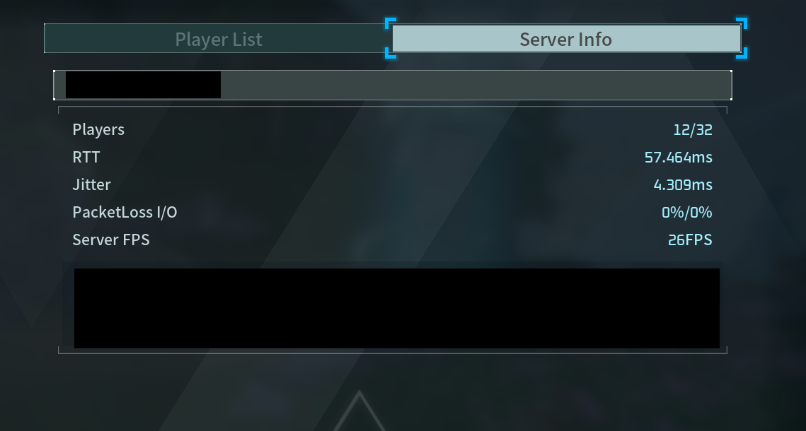

## So the Discord wanted a Palworld server

Naturally the ask escalated the second I said yes. What started as "can we get a Palworld server going" turned into hosting for a community pushing 200 members, with something like 20 people online swinging pickaxes at the same time. On my own Proxmox box, in my own house, because apparently I never learned to say "let's just rent a Bisect Hosting box for $15 a month" like a normal person.

Two things mattered to me more than anything else before I touched a single setting. First, security, since the moment this thing is up it's sitting on the open internet with 200 strangers-of-friends able to poke at it. Second, I wanted it as close to hands-off as I could get it, because I did not sign up to be someone's unpaid sysadmin at 2am every time the server hiccups. I already had a domain sitting around doing nothing, filed away as "maybe later, for an admin portal," and definitely not needed just to run the game itself.

This is part one of a build log I'm splitting into chunks because otherwise it's an unreadable wall of text. This part covers the planning, the base VM, getting LGSM running, and the config traps that came bundled with all of it. Network segmentation happened in here too but that's its own rabbit hole, saved for later.

## Planning, or: the part where I pretend I have foresight

Before spinning up anything I sat down and actually thought about the shape of the whole thing, which, if you know me, is not always my first instinct.

- **Sizing**: Palworld eats RAM for breakfast according to the official guidance, so I landed on 8 vCPU, 16 to 20GB RAM, and 60GB+ of NVMe-backed storage for a 20-player target.
- **VM, not a container**: the dedicated server binary wants kernel features that LXC just doesn't play nice with, and since this thing is public-facing, real isolation felt worth the overhead.
- **Security posture, decided before anything existed**: RCON and any admin/API surface were never going to touch the internet directly. Only the game port itself gets to be public. Everything else stays internal or tunnel-only.
- **Hands-off strategy**: instead of hand-rolling my own install/update/monitoring scripts like some kind of masochist, I standardized on **LinuxGSM (LGSM)**, a widely-used game server management framework that already does install, update-checking, crash monitoring, and backups for a pile of supported titles, Palworld included.
- **The domain**: parked for a maybe-later admin portal. Palworld's traffic is UDP, which gets zero benefit from sitting behind an HTTP proxy, so the domain wasn't doing anything useful for the game server itself. It'd still need a direct port-forward no matter what I did with DNS.

## The VM and the OS

I drafted a whole `qm create` script to fully automate the VM build on the Proxmox host. Then I didn't use it. Went through the GUI by hand instead, but I kept a checklist of the settings that actually mattered, because clicking through defaults blind on something public-facing felt like a bad way to find out what I forgot.

| Setting | Choice | Why |
|---|---|---|
| Machine type | q35 | modern chipset, better VirtIO/PCIe support |
| BIOS | SeaBIOS | skips the EFI disk and the secure-boot/GRUB headache for a single-purpose box |
| CPU type | host | passes real CPU features through, fine since I've got one node and no live-migration to worry about |
| Memory | fixed, ballooning off | a game server wants RAM that stays put, not RAM the host can claw back under pressure |
| Disk | VirtIO SCSI, SSD emulation + discard + iothread on | best throughput/compat balance, and TRIM support |
| Network | VirtIO | actually fast, unlike pretending an e1000 NIC is still 2009 |
| QEMU Guest Agent | enabled in VM options **and** installed in-guest | clean shutdown, accurate IP reporting, fs-freeze on snapshots, and yes you need both halves, I nearly only did one |
| Start at boot | yes | comes back after a host reboot without me lifting a finger |

I did consider full-disk encryption and then talked myself out of it. My actual threat model here is network exposure, not someone breaking into my house to steal a hard drive out of a server rack in my living room. LUKS would've actively fought the hands-off goal too, since an encrypted root volume wants a passphrase typed at every single boot, or a much more involved TPM setup that needs the UEFI path I'd already dodged for simplicity. Encryption earns its keep on the offsite backups instead. Local disk, not worth the hassle.

For the OS itself: minimized Ubuntu Server, not the regular install, smaller attack surface for a box that only does one job, with any missing tools like curl, tar, or python3 added explicitly later instead of trusting a bigger default image to have thought of everything. I picked a non-obvious admin username too, nothing like `admin`, `ubuntu`, or `root`, since those are the first three guesses any script kiddie's brute-forcer throws at SSH. Made sure "Install OpenSSH server" was checked, easy to miss on that screen and there is zero remote access without it. Skipped the featured-snaps screen entirely. Didn't need Nextcloud bundled onto my game server, thanks.

One small wrinkle right after install: SSH refused every login attempt, and I didn't actually know why yet. Turned out the installer's "import SSH key from GitHub" option only pulls whatever key existed on the account *at install time*, something I had to dig into rather than already knowing going in. Once that clicked, fixing it was quick through the Proxmox console.

## Setup scripts, and the first real bugs

I wrote five numbered scripts, `setup/00` through `05`, each meant to run exactly once, in order, on the fresh VM:

- **00, system prep**: apt update, 32-bit library support because steamcmd needs it, core tooling.
- **01, dedicated service user** (`pwgs`): the game server never runs as root, and never as my own admin account either. No password auth on that account at all, access only through `sudo -iu pwgs`.
- **02, LGSM + Palworld install**, run as `pwgs`.
- **03, firewall (UFW)**: only SSH and the game/query UDP ports open. RCON and the REST API stay closed here, reachable later only through a tunnel, never directly.
- **04, cron jobs** for the whole hands-off thing, more on that below.
- **05, `PalWorldSettings.ini` patching**, also below.

`04-cron-setup.sh` failed with a permission error on a temp file the very first time I ran it. I'd run the script with `sudo`, so `mktemp` created its scratch file owned by root with `600` permissions, and then the script tried to have `pwgs`'s own `crontab` command read that same file, which obviously it couldn't, since it wasn't `pwgs`'s file to begin with. Fix was to move the whole crontab-editing block inside `sudo -u pwgs bash <<EOF ... EOF`, so the temp file gets created and owned by `pwgs` from the start and never crosses a user boundary in the first place.

Smaller, more annoying one: `scp` doesn't reliably preserve the execute bit across transfers. Every single script needed `chmod +x` re-applied after copying it to the VM. Every time. You'd think I'd remember after the second one.

## Getting Palworld to actually start

First `./pwserver start` attempt failed outright:

```
tmux: command not found
```

LGSM uses tmux to hold the game server's session, and I hadn't put it in my original prep package list. Classic. Installed it, added it to `00-system-prep.sh` so future-me doesn't repeat this.

Next attempt actually ran, but threw a bunch of noisy, non-fatal warnings:

```
jq: command not found
bc: command not found
```

Both come from LGSM's own info-gathering helpers. `jq` parses a public-IP lookup, `bc` does math for a system-requirements check. Cosmetic, not blocking, but I installed both anyway just to shut the log noise up.

Then I got a startup block that looked, at first glance, like the whole thing was on fire:

```
dlopen failed trying to load: steamclient.so ... No such file or directory
[S_API] SteamAPI_Init(): Loaded '/home/pwgs/.steam/sdk64/steamclient.so' OK.
[S_API FAIL] Tried to access Steam interface SteamUser021 before SteamAPI_Init succeeded.
...
Running Palworld dedicated server on :8211
```

Turns out this is a known, harmless quirk of the Palworld binary. It tries a local path for `steamclient.so` first, fails, falls back to the real SteamCMD-installed copy, and the `FAIL`-labeled lines that follow are just cosmetic spam this specific binary throws even when everything's fine. The line that actually matters is the very last one. Lesson learned: don't panic at the word `FAIL` in a log, go find the actual success line for whatever you're running before you start pulling your hair out.

## The `PalWorldSettings.ini` trap

I deliberately did not hand-write a config file from memory here. It's got something like 100 keys, and guessing exact defaults for a game version that might've patched since I last checked felt like a great way to silently break something I wouldn't notice for a week. Instead: let the server generate its own correct-for-this-version file on first start, then patch only the specific keys I actually care about, via a `sed`-based script, and leave everything else alone at whatever the generator picked.

One real bug in that script: the `patch()` function used `sed`'s default `/` delimiter, which broke the moment it hit `BanListURL`, whose value is itself a URL full of slashes:

```
sed: -e expression #1, char 40: unknown option to 's'
```

Fixed by switching the delimiter to `|`. Obvious in hindsight, as these things always are.

Running the script also surfaced a path/user mismatch I didn't see coming: `sudo -iu pwgs 05-palworldsettings.sh` failed as "command not found," because `sudo -iu` switches to `pwgs`'s home directory and `$PATH`, and a relative script path sitting in a *different* user's home just isn't there from that vantage point. Running it directly as my own account instead technically "worked," no error at all, but it silently looked in the wrong home directory for the ini file, since the script resolves its target via `$HOME`. Fix: copy the script into `pwgs`'s own home, `chown` it over, run it from there as `pwgs`, so the executing user, the file location, and `$HOME` all finally agree with each other.

The bigger, more annoying trap: after patching `ServerName` in the ini, the server still showed up in-game as "LinuxGSM." Turns out LGSM's own launch command passes `-servername='LinuxGSM'` as a command-line flag straight to the game binary, which just wins over whatever the ini says, no contest. Found it by grepping LGSM's config directories for the literal string "LinuxGSM," which pointed at `servername="LinuxGSM"` sitting in `_default.cfg`.

Important thing I learned here: `_default.cfg` is LGSM's own master template and it gets overwritten on every LGSM update, so edits there don't stick around. The durable place for overrides is `common.cfg`, which doesn't even exist by default, you just create it and append to it. Grep for the wrong value to find whatever's actually setting it, override in `common.cfg`, never touch `_default.cfg`. This became my go-to move for anything LGSM-controlled, and sure enough it came up again almost immediately for the port number.

## Changing the game port (a two-attempt affair)

First attempt to move off the default `8211` to a custom port touched LGSM's `common.cfg` override and the ini's `PublicPort`, but not the router's port-forward, which didn't exist yet at that point in the build. Reported to myself as "not working," so I reverted all three layers back to `8211` instead of trying to half-debug a state I'd already made a mess of. Get back to known-good first, then retry properly.

Once the port-forward actually existed, I redid it as one coordinated sweep across every layer at once: LGSM `common.cfg`, the ini, the VM's UFW rule, and the router's NAT rule, all at the same time. Coordinated instead of partial, and almost certainly the reason the first attempt silently failed to begin with.

## RAM doesn't have an "on" switch

Someone asked me to make sure the server could "use all the RAM." Worth being precise about this: memory usage is demand-driven, it's not a toggle you flip. There's no setting that makes a process claim more RAM than it actually needs at that moment. What actually matters is confirming nothing's capping it: VM-level allocation genuinely visible to the guest (`free -h`), no cgroup `MemoryMax`/`MemoryHigh` limit if a systemd service ever gets introduced later, no restrictive `ulimit` on the `pwgs` account, and swap present as an OOM safety net rather than treated as a hard ceiling.

## Static IP and the port-forward

Before any port-forward could be reliable, the VM needed a fixed address, otherwise a DHCP lease renewal would silently break the forward one day out of nowhere. Converted the VM's existing dynamic lease to a static one at the router and moved on.

The forward itself is a destination-NAT rule: inbound WAN traffic on the game/query UDP ports gets redirected to the VM's internal address. One thing worth checking explicitly on this kind of router setup: some configs carry a catch-all drop rule in the forward chain that blocks traffic even after NAT translation already happened. If that's sitting there, the accept rule needs to go *above* it, since rule order is first-match-wins, same instinct as writing any firewall rule anywhere.

## Reconciling cron with what LGSM actually recommends

LGSM's own docs suggest a specific cron layout: `monitor` every 5 minutes, `update` every 30, and a weekly `update-lgsm`. Mine didn't match that at all. I'd deliberately scheduled `update` once nightly at 5am instead, specifically so a patch wouldn't land mid-day and force-restart the server while people were actively playing (`update` stops, patches, and restarts the whole thing if it detects a new version).

That's a real trade-off, not a bug, so I named it out loud instead of quietly picking one: same-day patch availability versus zero risk of a mid-session interruption. I ended up going with LGSM's more aggressive 30-minute default.

Folded in at the same time: a nightly `backup` job, which isn't in LGSM's own suggested list, but a hands-off backup story was one of my actual goals here so it stayed independently, a weekly `update-lgsm`, and an `@reboot` entry so the server comes back up after a host or VM reboot without me doing anything. That last one exists because `./pwserver install-service`, the systemd integration I fully expected to exist, turned out not to be in this LGSM version's command list at all. Rather than hand-build a systemd unit that risked fighting the cron-based `monitor` job for control of the same process, the simple `@reboot` line did the job well enough.

## Writing it all down

Last thing before Discord entered the picture: a standalone `ADMIN-GUIDE.md`, written for someone who did not sit through any of this build and just needs to operate the server day-to-day. It skips the entire install history and covers connection info, the everyday LGSM command set, the `common.cfg` vs. `_default.cfg` vs. `.ini` gotcha, called out explicitly since it bit me twice already above, the cron schedule and what each job does, manual backup/restore steps (LGSM has no built-in restore, it's a manual stop/extract/start process), basic RCON moderation, and a port/exposure reference table.

RCON moderation leans on the same in-game server info panel LGSM exposes over the REST API, the same one the admin guide walks through:



At this point the server was up, patched to how I wanted it, backing itself up, and documented well enough that I wasn't the single point of failure anymore. Next up: a Discord bot for player-initiated restarts, offsite backups to a NAS, and the bugs that came bundled with both.
