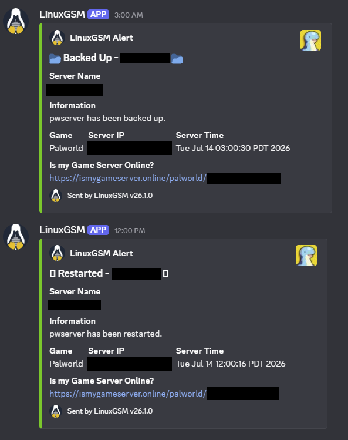
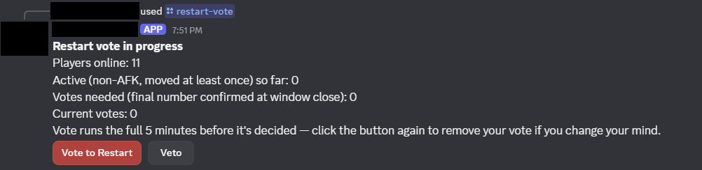

[Part 1](/blog/2026/self-hosted-palworld-part-1) covered planning, the SSH lockout I walked myself into, and getting LGSM running. Server was up, patched, documented. This part is where the community actually started asking for things, and where I found out exactly how many small, dumb bugs it takes to make "Discord alerting" and "a restart bot" trustworthy enough that I stop getting pinged about it personally.

## Two things that both get called "the Discord webhook"

There are two genuinely different features that both get lumped under "the Discord webhook," and conflating them just wastes your afternoon. First: **LGSM's own alerting**, a documented feature that ships LGSM's own status notifications, start/stop/crash/update, to a channel via a webhook URL. Second: **Palworld's native in-game event webhooks**, join/leave/death posted directly by the game itself. I'd assumed the second one existed, early on, without actually checking, because why wouldn't it. Rather than configure it on a hunch, I went and verified: grepped LGSM's config templates and the generated `PalWorldSettings.ini` for anything Discord-related, checked the server binary's own `--help` output. Nothing. This specific build just doesn't support native in-game event webhooks. Worth telling "I assumed this" apart from "I verified this," because configuring a feature that doesn't exist is a great way to spend an hour chasing a webhook that was never going to fire.

Setting up the one that does exist revealed a second layer I also hadn't accounted for. `discordalert="on"` plus a webhook URL only enables the transport. `./pwserver test-alert` fired off a message just fine, but that doesn't mean an actual event, like a crash, ever triggers one for real. The separate switch that governs whether events fire at all turned out to be `statusalert="on"`, documented inline in LGSM's config as "Alert on Start/Stop/Restart." Found the same way as the servername and port issues from part 1: grep the full config template instead of assuming, set the override in `common.cfg`.

Once both switches were finally on, the scheduled backup and restart jobs from the cron work below started showing up in the channel completely on their own:



## A restart bot people can actually use

I wanted a way for players to request a restart without needing SSH access, with a guardrail baked in so one person can't unilaterally kick everyone off mid-session. Landed on a slash command that checks how many players are online via the REST API, posts a button-vote, and only restarts if enough of them approve within a window. A cooldown keeps anyone from spamming it.

A few things I actually cared about in the design:

- **Zero new open firewall ports.** The bot connects outbound to Discord's gateway and talks to the REST API over localhost, both directions the box already needed anyway. No new attack surface, no new thing to worry about at 3am.
- **The actual restart goes through `./pwserver restart`**, the same LGSM primitive I use everywhere else, instead of trusting the REST API's own shutdown endpoint to leave LGSM's tmux session state clean. Boring and proven beats theoretically elegant.
- **The in-game warning uses a separate `announce` call**, decoupled entirely from the restart action itself, rather than trusting one endpoint to both warn and stop.
- Ran as its own systemd service. This didn't collide with the systemd-vs-cron worry I had in part 1, that concern was specifically about two things fighting over the *same* game server process. The bot's an entirely separate process, so systemd was just the obviously correct fit here.

While wiring this up, curling the REST API from the VM itself, expecting a player list back, got me this instead:

```
curl: (7) Failed to connect to 127.0.0.1 port 8212 after 0 ms: Could not connect to server
```

`ss -tln` confirmed nothing was listening at all. Checking the generated `.ini` turned up the real cause: `RESTAPIEnabled` and `RESTAPIPort` didn't exist in the file, period, not set to `False`, just plain absent. Same underlying mechanism as the LGSM config-layer traps from part 1, just a different symptom this time. The `sed`-based patch script from part 1 can only replace an *existing* line, so it had been silently doing absolutely nothing for these two keys the entire time, with no error anywhere to show for it. Fix: rewrote the patch helper into a real upsert, check if the key exists (`grep`), replace it in place if so, insert it just before the config's closing parenthesis if not. Re-ran the now-idempotent script once and every previously-patched key reapplied cleanly. A script that runs without error is not the same as a script that did what you think it did. `sed` with no match is a no-op, not a failure, and it's worth actually checking a config file's real state instead of trusting an exit code.

## Backups that leave the building

Extended the existing local backup job to also copy each backup offsite, to an OpenMediaVault NAS sitting on the same network, and delete the local copy only once that copy is confirmed intact. Keeps the VM's disk from slowly filling up while backups still survive elsewhere if the VM ever eats itself.

- **A dedicated OMV service account**, scoped to exactly one shared folder via OMV's per-share privileges, not some general-purpose or admin account, so a compromised credential on the game server can't reach anything else on the NAS.
- **SMB/CIFS, not NFS**, specifically because I wanted actual username/password authentication. NFS leans host-IP-based instead of credential-based, which didn't fit what I wanted here.
- **Credentials in a dedicated file** (`/etc/samba/creds/...`, `chmod 600`, root-owned), referenced from `/etc/fstab`, instead of the password just sitting directly in `/etc/fstab`, which is world-readable to anyone who gets a shell.
- **The offload script copies, byte-compares, then deletes**, strictly in that order, and it refuses to delete the local original unless the comparison against the remote copy actually succeeds. A backup script that deletes optimistically, assuming the copy worked, is a genuinely good way to lose data for real.

### A cluster of very ordinary, slightly embarrassing bugs

This phase produced the highest density of dumb little mistakes in the entire build, and none of them were exotic:

- A literal `<omv-ip>` placeholder from a walkthrough got pasted straight into `/etc/fstab` instead of the real address. Caught immediately, at least, since the mount couldn't exactly resolve a host literally called `<omv-ip>`.
- Guessed a share name (`palworld-backups`) instead of confirming it actually existed. `smbclient -L //<nas-ip> -U <user>`, which lists every share a given account can see, settled it in one command instead of me guessing a second and third time.
- A credentials file with the wrong username in it produced a generic `Permission denied`, completely indistinguishable from an actual OMV-side privilege problem just from the error text alone. Isolating it meant testing with an explicit, manually-typed username and password on the command line instead of trusting the file, which is exactly what surfaced the mismatch.
- A follow-up mistake compounded the fix I'd just made: after correcting the crontab, `crontab -l | ... > /tmp/cron.bak` got run as the wrong user first. It failed, but the shell had already created `/tmp/cron.bak` owned by that wrong user before the command bailed, so the next, correctly-run attempt then failed with `Permission denied` on a shared path it didn't own either. Fix was just to use a path inside the correct user's own home instead of a shared system temp directory.

Same shape every single time: a plausible-looking value, an IP, a share name, a username, a path, subtly wrong, producing an error message that didn't point anywhere near the actual mistake. The fix each time was the same instinct: stop guessing, make the tool show you the actual current state (`smbclient -L`, manually-typed credentials, `ls`/`grep`) instead of debugging from vibes.

## The backup schedule, and a UTC surprise

Wanted the backup cadence changed to three times a day, 9PM, 12PM, 3AM, with the offsite offload running immediately after each successful backup instead of on a separately-scheduled guess at how long the backup would take.

Along the way I found a real bug that had apparently been there the whole time: the existing "nightly at 4AM" job had actually been firing at **9PM**. Root cause: the VM's system clock was set to UTC, while the actual expectation was several hours behind that. A `4:00` cron entry interpreted in UTC lines up exactly with 9PM Pacific the day before. Cron always runs on system time, and if the system's timezone doesn't match what the administrator actually expects, every scheduled time is silently offset by however many hours separate the two, and nothing about the job itself is wrong. It was just very quietly lying to me the whole time.

Rather than keep mentally converting between UTC and local time for every future cron entry I'd ever write, I fixed it at the source: `timedatectl set-timezone America/Los_Angeles`, so entries could just be written and read in local time with zero ongoing translation in my head.

Schedule and offload logic then got combined into one cron line, chained with `&&`:

```
0 21,12,3 * * * pwserver backup ... && offload-backup.sh ...
```

Guarantees the offload only ever runs immediately after, and only after, a backup that actually succeeded, instead of firing on a fixed delay that assumed the backup would finish in time and just hoping for the best.

## Deploying the bot for real

With the REST API finally confirmed working end-to-end, I moved on to actually deploying the restart-vote bot: Discord Developer Portal, application, bot token, OAuth2 invite with `bot` + `applications.commands` scopes, code onto the VM, a Python venv, `.env` config, a systemd service.

The vote mechanics got refined further based on how the community actually wanted it to behave once real people started using it:

- **Threshold dropped from 75% to 50%**, with a hardcoded exception: exactly two players online requires both to agree, since a straight 50% of 2 is just 1 vote, and one vote is not a majority no matter how you round it.
- **AFK filtering**: rather than trust "online" as a stand-in for "present," the bot samples every connected player's in-world coordinates every 30 seconds across the full 5-minute vote window. Anyone whose position never changes across the whole window gets excluded from the count the threshold gets calculated against.
- **The vote no longer closes early on hitting the threshold**, it runs the full window and tallies once at the end. A deliberate trade against responsiveness, forced by two other requirements arriving at the same time: AFK status can't be known until the window's actually elapsed, and letting someone change their vote only makes sense if the vote's still genuinely open when they do it.
- **A veto button**, restricted to a specific admin role, ends the vote immediately regardless of tally, plus a separate `/restart-force` command for the same role that skips voting behind a personal Yes/No confirmation.

In practice it looks like this: current player count, how many are counted as active instead of AFK so far, and a live vote/veto pair that updates as the window runs.



### A chain of failures that each looked exactly like the last one

**Dependencies weren't actually a surprise this time**, small win. The bot's Python deps were captured in `requirements.txt` from day one, so zero missing-package surprises here. But everything else lined up to bite me one after another:

**1. `403 Forbidden (error code: 50001): Missing Access`**, on the very first start, from the bot's attempt to register its own slash commands. Root cause: generating an OAuth2 invite URL with the right scopes baked in doesn't actually do anything by itself, someone still has to open it and complete the authorization flow in a browser. Easy to think "I've got the link, that's the setup done" when the link alone grants absolutely nothing. Confirmed it by checking whether the bot even showed up in the server's member list. Fix: reopen the invite, complete authorization for real this time.

**2. Logs then looked completely clean, no exception anywhere, but the "Logged in as ..." confirmation line was just missing.** Turned out to be totally unrelated to the underlying problem: Python's `print()` is fully buffered, not line-buffered, when stdout isn't a real terminal, which is exactly the case under systemd. The process was fine the whole time. Its own success message was just sitting in a buffer somewhere, making a perfectly healthy process look silent and stuck. Fixed generally, not just for this one symptom, with `PYTHONUNBUFFERED=1` in the systemd unit, which closed off an entire category of "is it actually running or not" uncertainty for any future debugging of this service.

**3. Once logs were clean and unbuffered, the slash commands still didn't show up in Discord at all**, not in autocomplete, not typed manually, on multiple accounts, after hard client restarts, in a channel where other bots' commands worked completely fine. Every plausible client-side explanation was ruled out by this point, which is what justified skipping past the Discord UI entirely and just asking Discord's own API directly:

```
curl -H "Authorization: Bot <token>" https://discord.com/api/v10/applications/<id>/guilds/<id>/commands
```

An empty `[]`, despite a clean, error-free sync sitting right there in the logs, was the actual smoking gun. `@tree.command` in discord.py registers a command globally inside the bot's own command tree object, not against any particular guild. `tree.sync(guild=X)` only pushes whatever's already sitting in *that guild's own slot* within the tree, which starts completely empty no matter how many global commands exist. The sync had been succeeding the entire time, correctly, at uploading an empty list. No exception anywhere, because syncing zero commands is a perfectly valid API operation as far as Discord's concerned. Fix: call `tree.copy_global_to(guild=X)` to copy the global command definitions into that guild's slot *before* calling `tree.sync(guild=X)`.

The most important lesson out of this whole phase: **a successful API call is not the same thing as a correct one.** Every earlier bug in this build had at least thrown an error I could go chase. This one didn't. The only way to catch it was to stop trusting "no exception" as proof of anything and independently verify the actual end state against the system of record, the same instinct that solved the earlier `sed`-no-op and cron-timezone bugs, just applied one layer further out than I'd thought to look.

**4. Smaller, final one**: `/restart-force` and the veto button both initially failed with "you don't have permission," even for an account that clearly should've qualified by any reasonable read of the situation. That account held a different, *higher* role in Discord's own hierarchy, but the bot's permission check looks for one specific, exact role ID, full stop, it has no concept of Discord's role hierarchy or of one role including another. Worth deciding this consciously for any bot with custom role gates: Discord's built-in permissions support inheritance through role position, a bot's own custom checks generally don't, unless you explicitly go code that in yourself.

## Making the bot actually resilient, not just resilient-looking

A pretty direct question, "how do I make sure the bot is always active," surfaced a gap between what the systemd unit looked like it guaranteed and what it actually did. `Restart=on-failure` only restarts a process that exits with an actual failure signal, nothing for a clean exit, and systemd applies a default rate-limit on top, five restarts within ten seconds, after which it just stops trying entirely and marks the whole unit failed. A bot that crash-loops through a rough patch, a transient Discord API failure say, could hit that limit and just stay down, silently, with no further restart attempts at all, which is the exact opposite of "always active," despite `Restart=on-failure` giving every appearance of being the resilient choice.

Fixed with two changes: `Restart=always`, which covers every exit path instead of just failures, and `StartLimitIntervalSec=0`, which removes the rate limit entirely. Explicitly scoped out of this fix: a hung-but-not-crashed process. Systemd only restarts things that actually exit, so a deadlocked event loop that never terminates wouldn't trigger anything at all. Catching that needs a heartbeat/watchdog mechanism, which I didn't build here, a reasonable line to draw given how much rarer that failure mode is for a simple bot than an outright crash, but worth naming out loud as a known gap rather than pretending I didn't think of it.

## Scheduling, corrected a second time

The backup schedule turned out to be wrong in a second, completely unrelated way that nobody had noticed until now: what was meant to be "9PM, 12PM (noon), 3AM" had actually been written with the hour value for midnight instead of noon. `12` in a 24-hour cron field is noon, not midnight, an easy, extremely ordinary mix-up between 12-hour clock intuition, "12 PM" reads as "twelve" in your head, so you type `12`, and 24-hour cron semantics, where midnight is `0` and `12` is unambiguously noon. Fixed by writing the actual intended hours explicitly, `21,0,3`, instead of carrying the mistaken assumption forward another day.

Adding in-game warnings before backups and restarts, 5 minutes and 1 minute out, meant restructuring how the jobs fire: the warning and the wait need to happen *before* the real action, so cron now fires 5 minutes ahead of the intended clock time, and a small wrapper script posts the first warning immediately, sleeps 4 minutes, posts the second, sleeps 1 more, then actually does the thing, landing the real backup or restart exactly on the originally intended time, with the timing logic living in the script rather than in cron's own scheduling.

This surfaced a genuine collision once a restart also got requested at 12AM and 12PM: the midnight restart would fire at the exact same instant as the midnight backup, risking the restart killing the server mid-backup, or the backup running against a server that just got yanked out from under it. Rather than silently pick a behavior and hope nobody noticed, I surfaced it as a real trade-off out loud: the midnight restart got deliberately offset ten minutes later, 12:10AM instead of literal midnight, so the backup and offload finish first, while the noon restart, no conflict with anything else on the schedule, stayed exactly on time. Small collisions like this are easy to miss when jobs get added one at a time instead of checked against the whole existing schedule at once.

At this point the server had a working restart bot, backups that actually leave the building, and a schedule that finally agreed with itself. Part 3 covers what happened once this stopped being a private project I quietly managed and started needing an actual public face: a dependency map, containerizing the whole thing, a status page, an uptime tracker, and locking the last plaintext hop down with TLS.
