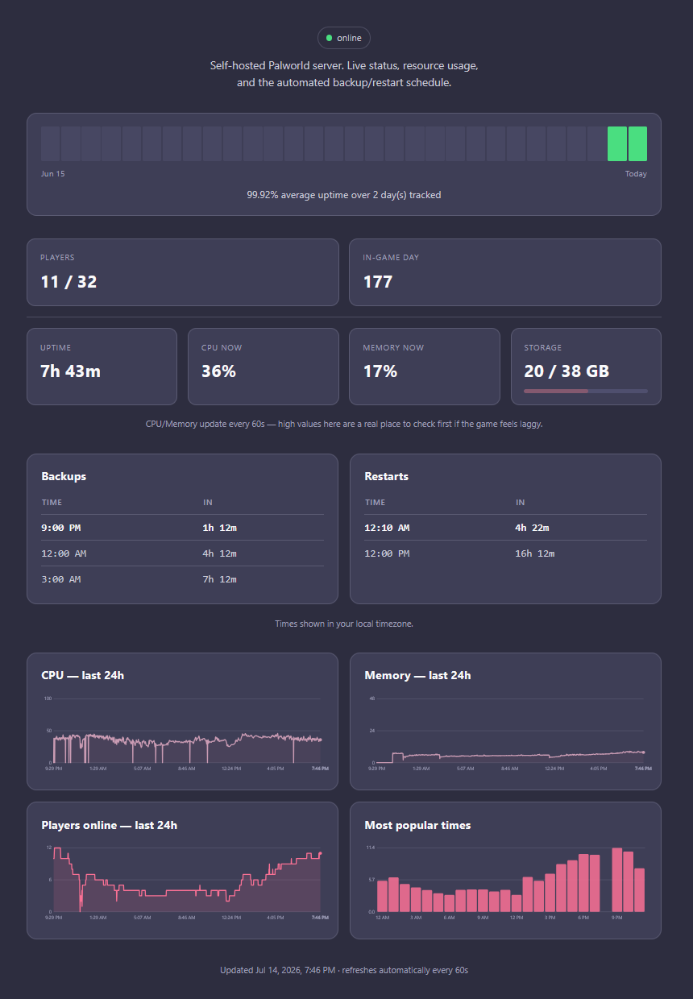
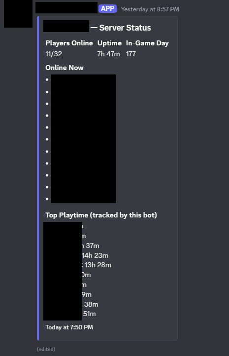

[Part 1](/blog/2026/self-hosted-palworld-part-1) covered the initial build, [part 2](/blog/2026/self-hosted-palworld-part-2) covered the bot and offsite backups. By this point the server had been chugging along reliably for a while, which honestly made me nervous, since nothing stays quiet forever. This part is about what happened once it stopped being a private project I fiddled with alone and started needing an actual public face: a dependency map that caught a real bug, a full containerization, a status page, an uptime tracker, and finally closing that last plaintext hop I'd been ignoring.

## A dependency map that paid for itself immediately

Two things converged at once: a public-facing status page, the "admin portal" idea that had been sitting on the outstanding list since the very first planning conversation back in part 1, and a request for a full dependency map of the project, aimed at three goals, consolidating duplicated config, automating what was still manual, and finally getting plaintext secrets out of the shell scripts they'd been copy-pasted into throughout the entire build.

Building that map surfaced something concrete and, honestly, kind of embarrassing: `setup/03-firewall.sh` had silently drifted. It still opened the *original* default game port from early in the build, not the port actually in use since the mid-build port change back in part 1. Nobody had ever re-run that script to notice, so three separate places that should've agreed on the port, the game's own `.ini`, LGSM's launch config, and the firewall rule, had quietly disagreed with each other for who knows how long. Exactly the failure mode a single source of truth is supposed to prevent, and exactly the reason I built the map in the first place.

## A status page that can't become an attack surface

The requirements here were specific and non-negotiable: public enough to share with the entire Discord community, but unable to leak anything sensitive, and structurally incapable of being turned into a DDoS vector against my own house. Both constraints pointed at the same design. Rather than the page proxying live queries to the Palworld REST API on every single visit, which turns public traffic directly into backend load, the textbook way an "innocent" status page quietly becomes an attack surface, the Discord bot itself renders a small, deliberately minimal static HTML snapshot every 60 seconds, four fields, no player names, no IPs, and a separate nginx container just serves that already-rendered file. A flood of visitors hits nginx serving static content, never the origin API. Cloudflare Tunnel carries it out to the internet with no inbound port opened on the router at all, the tunnel connection is initiated outbound, from the VM, so there's nothing for an attacker to even find by scanning me in the first place.

A late but genuinely useful addition: a countdown to the next scheduled backup/restart. Since that schedule is fixed and already lives in the cron config from part 2, this needed no new API calls or external state whatsoever, just a function comparing the current local time against the known daily schedule, computed fresh on every render.



### Matching an existing identity instead of inventing one

I got asked to make the page match this blog rather than look like a generic dashboard someone slapped together from a template, which is a good reminder to look at what already exists before designing anything new from scratch. This blog runs on Hugo with the Blowfish theme and a custom color scheme file, real design tokens already defined as RGB triples. Rather than eyeball colors off a screenshot like an animal, I pulled the literal values straight out of that file and converted them to hex, giving me an exact, non-generic palette to build the whole page around. The favicon got the same treatment: copied the real file out of the blog's `static/` folder and base64-encoded it from disk at import time, instead of hand-transcribing a base64 blob into source, which is a genuinely real risk, since a single mistyped character in a multi-thousand-character string silently produces a broken image with absolutely no error anywhere to tell you why.

### Charts that don't lie about scale

Player count, CPU, memory, and disk didn't exist as trackable history before this, only current snapshots. Added a rolling history file the bot writes on its existing 60-second poll loop, with a 7-day retention window at first. Two details worth keeping:

- **Percentage metrics got a fixed 0-100% scale, not auto-scaled to whatever the window's own peak happened to be.** Auto-scaling a percentage is actively misleading. A 30% CPU reading auto-scaled to fill the chart's full height reads as "near max" when it's actually pretty chill. Player count, which has no fixed ceiling, kept auto-scaling.
- **Every chart got a visible axis, not just hover tooltips.** A page meant to be glanced at shouldn't require an interaction just to convey its basic scale.

## Splitting a 900-line file into eleven

I got asked, point blank, whether one file mixing Discord bot logic, REST API calls, system metrics, and an entire HTML/CSS/JS page template as Python f-strings was actually good practice. I answered honestly: no. Absolutely not. Then split it: `config.py` for every env var and constant, `palworld_api.py` for REST calls, `storage.py` for persistence, `discord_ui.py` for the interactive views, `commands.py` for the slash commands, a `status_page` package for rendering, and the HTML/CSS/JS pulled out into real separate files instead of staying inlined inside a Python string like some kind of crime scene. That last part incidentally solved a smaller standing annoyance for free, the old f-string needed every literal CSS brace doubled (`{{`/`}}`) just to avoid colliding with Python's own substitution syntax. Once CSS/JS became genuinely separate files with zero Python formatting applied to them, that entire class of escaping mistake became structurally impossible instead of just something I had to remember to be careful about.

Verified more rigorously than a syntax check too: a real virtualenv with the actual dependencies installed, importing the full module graph end-to-end with placeholder env vars, confirming all four slash commands still registered on the command tree, rendering the status page against synthetic data to make sure no unsubstituted `$placeholder` leaked into the output. Restructuring nine hundred lines of working code into eleven files is exactly the kind of change where "it still parses" is not remotely the same claim as "it still works."

## Why this got containerized

The dependency map gave me the actual justification here, not just a vague "Docker is good practice" gut feeling. The bot process and the website generator were already conceptually separate concerns living inside one process, and the map's own stated goal, consolidate, automate, stop duplicating secrets, is close to exactly what Docker Compose is for. One `.env` file referenced by multiple services beats one secret value copy-pasted into N shell scripts, which is precisely the failure pattern the map had just finished cataloguing in painful detail. Bot, nginx, and the tunnel split into three containers, sharing one secrets file and a couple of named volumes.

Not a costless move either, and the real trade-off got named out loud instead of quietly smoothed over: the bot's core restart functionality shells out to a host-native LGSM script and depends on reaching the VM's own loopback REST API, neither of which plays naturally with container network isolation. Rather than pretend this away, the bot container runs with host networking and a bind-mount into the game server's home directory, deliberately sacrificing some isolation for this one service, while nginx and the tunnel container get full normal isolation, since neither of them shares that dependency. Palworld/LGSM itself stayed alone entirely, already working, deeply wired into systemd and cron conventions from parts 1 and 2, and re-platforming a stateful game server for uncertain benefit was a worse trade than accepting one less-isolated container.

### The ephemeral filesystem catch

Containerizing surfaced a real bug before it caused any actual damage, which I'll take as a win: the bot had been persisting its playtime leaderboard and the ID of the Discord message it keeps editing to a couple of small JSON files sitting right next to the script itself. On bare metal this just worked, those files were part of the filesystem, permanently, no questions asked. Inside a container, that same location is baked into the image layer and wiped clean on every rebuild. Every future `docker compose build` would have silently reset the leaderboard to zero and lost track of the bot's own status message, with no error anywhere to notice by, just a quiet reset nobody would clock until someone asked where their playtime went. Caught by asking "what happens to this state on a rebuild" before the first rebuild ever actually happened, fixed with an explicit override for where that state lives, backed by a real persistent volume, instead of relying on an implicit filesystem guarantee containers just don't make.

That's the same message the leaderboard fix was protecting, the bot edits one Discord message in place rather than posting a new one every cycle:



### A familiar chain of ordinary bugs, one layer up the stack

- `apt install docker-compose-plugin` and `apt install cloudflared` both failed with "unable to locate package." Neither ships in Ubuntu's default repos, each needed its own vendor apt repo added first. The exact same class of mistake as expecting `tmux`/`jq`/`bc` to already be there, back in part 1, assuming a tool's available just because it's common, rather than because it's actually declared as a dependency anywhere.
- A stale `discord-bot/` folder on the VM caused `docker compose build` to fail looking for a `Dockerfile` that only ever existed in the project's local copy. The folder on the VM was still the one copied over during the original native deployment, long before Docker entered the picture at all.
- A truncated Discord bot token in `.env` produced the exact same `Improper token has been passed` error an actually-invalid token would give. Ruled out quotes and split lines via `docker compose config` first before concluding the simplest explanation: just paste it again in full, or reset it outright and stop guessing.
- A Docker named volume, root-owned by default, didn't accept writes from the non-root UID the bot container deliberately ran as. Fixed by finding the volume's real host path (`docker volume inspect`) and `chown`-ing it to match.
- A bind-mounted Cloudflare Tunnel credentials file wasn't readable by the container's UID either, same shape, different mount type, same fix energy.
- A Cloudflare `1033` error, "tunnel not connected," pointed straight at the `cloudflared` container's own logs rather than anything DNS or nginx related. Reading what the specific error code actually meant narrowed the search immediately instead of me guessing across the entire request path like a headless chicken.

None of these were hard bugs, and that's honestly the point worth naming again: containerizing something doesn't make this class of mistake go away, it just moves where it shows up next.

## A timezone bug the earlier fix didn't actually fix

Once the stack was running, the backup/restart schedule started showing times exactly 7 hours off, 2PM/5PM/8PM instead of the intended 9PM/12AM/3AM. Looked like a repeat of the UTC bug from part 2, but it wasn't. The schedule data itself was correct, and so, on paper, was the earlier fix, a `TZ=America/Los_Angeles` environment variable had already been added to the container. It just didn't work, for a reason a full layer deeper than I expected: `python:3.12-slim` doesn't ship the OS `tzdata` package, so setting `TZ` as an environment variable had silently no effect at all, the container's clock stayed UTC-based internally regardless of what I told it. The schedule math then treated Pacific-time clock values as if they were already UTC, and the browser's own correct conversion back to the viewer's real timezone applied the Pacific/UTC offset a *second* time, landing exactly on the 7-hour shift I was staring at.

Fix: stop depending on the container's ambient system timezone at all. Python's `zoneinfo` module, given an explicit `ZoneInfo("America/Los_Angeles")`, computes the schedule correctly regardless of what timezone the container's OS clock thinks it's in, backed by the `tzdata` PyPI package, pure Python, no OS-level dependency, so it's correct on literally any base image, including ones that strip tzdata to save a few megabytes. The earlier `TZ=` variable stayed in place, harmless and still useful for log timestamps, but I fixed the comment above it to stop claiming it solved something it never actually did.

A fix that addresses the right symptom isn't the same as one that addresses the right layer. The first timezone fix was a completely reasonable response to "the container's clock might not match the host's," it just quietly relied on an assumption, that `TZ=` always works, that wasn't true for this particular base image, and nothing about the fix itself would have surfaced that failure on its own.

## An uptime tracker, copied as a pattern, not just a look

I wanted an uptime tracker similar to a specific, already-seen reference widget: a strip of colored day-blocks with an aggregate percentage below it. Reproducing that exact pattern against this project's own data meant calendar-day bucketing of the existing history, an aggregate percentage computed from the true up/total sample ratio rather than an average of daily percentages, which would subtly misweight partial days, and days with no data yet rendered as neutral instead of silently counted as downtime. That last point mattered concretely, the tracker needed a full 30 days to actually look like the reference, and history retention was still set to 7 from earlier in this part, bumped specifically to serve this one feature and nothing else.

The bars themselves needed a second pass too, the first version looked like a row of rounded squares, not the thin vertical bars the reference actually used. Fixed by making them taller and tighter, more height, less width, smaller corner radius. "Similar to X" sometimes means matching a very specific visual proportion, not just the general vibe of the thing.

The memory chart moved from a 0-100% scale to an absolute 0-48GB scale, this VM's real total RAM, because the actual question being asked was "how much is being used," not "what fraction." A percentage and an absolute quantity are genuinely different questions, and a chart answering the wrong one isn't wrong exactly, it's just not useful for whatever anyone actually wanted to know. Same instinct as the fixed-percentage CPU chart earlier in this part, applied to a different axis: the correct scale is a property of what the metric means and what question's being asked of it, not a default you reach for out of habit.

## Closing the last plaintext hop

The status page's traffic path goes browser, to Cloudflare edge, to `cloudflared` (an outbound tunnel), to `status-nginx`. The first three legs are already fully encrypted by the Tunnel protocol itself, nothing to add there. The one plaintext hop was the very last one: `cloudflared` to `status-nginx`, over the Docker bridge network. Added a Cloudflare Origin CA certificate to `status-nginx` (443 instead of plain 80) specifically to close that hop, defense in depth against anything else that might land on the same compose network, not a fix for an exposed WAN gap, since there wasn't one to begin with.

Origin CA over Certbot was the clear choice here, for reasons specific to this setup rather than some general rule everyone should follow: nginx never actually faces a real browser, so a publicly-trusted cert buys me nothing. Certbot's 90-day renewal cycle is exactly the kind of ongoing-maintenance burden this whole project's been trying to design its way out of. And Origin CA certs support a 15-year validity, a set-once artifact instead of yet another moving part I have to babysit. `cloudflared` also trusts Cloudflare's own Origin CA automatically, so nothing extra to configure there either.

The rollout surfaced a pattern worth naming: `status-page/nginx.conf` and `cloudflared/config.yml` describe two sides of the same connection, and they have to change together or nothing works. Updating nginx to 443-only while `cloudflared`'s ingress rule still pointed at `http://status-nginx:80` produced an immediate `connection refused`, not subtle at all, but a reminder that this project has hit the "changed one side of a two-sided config, forgot the other" shape of bug before, LGSM's `.ini`-vs-`common.cfg` trap in part 1, the cron-vs-container timezone split earlier in this part, and it will happen again wherever a design deliberately splits one concern across two files.

Once both files finally agreed, the connection still failed, this time with:

```
x509: certificate is valid for *.example.internal, example.internal, not status-nginx
```

The handshake and CA chain were both completely fine, this was pure hostname verification, because `cloudflared` verifies the cert against the address it dials (`status-nginx`, the Docker service name) rather than the public hostname the cert was actually issued for. The fix, `originRequest.originServerName: status.example.internal`, doesn't touch the cert or the trust chain at all, it just tells `cloudflared` which name to check identity against, decoupling "what address do I connect to" from "what hostname do I verify identity against." A clean instance of "a successful-looking TLS setup is not the same as a correctly-configured one," the same class of lesson as the discord.py silent-sync bug from part 2, just one layer lower in the stack this time.

## Where it landed

Server's up, backed up, documented, alertable, restartable by vote, and has a public status page that can survive being linked in a 200-person Discord without becoming a liability I have to apologize for later. Almost none of the individual bugs across this whole series were hard in isolation, a missing package, a wrong delimiter, a file owned by the wrong user, a cert checked against the wrong name. The thing that actually held up across all three parts wasn't any single fix, it was the same instinct applied at every layer: trust the actual observed state of the system, a log, an API response, a file's real contents, over an assumption about what should be true, and isolate one variable at a time instead of guessing at the whole chain and hoping.

[Part 4](/blog/2026/self-hosted-palworld-part-4) covers what happened next: the restart button turning out to be silently broken since containerization, two async blocking-call bugs hiding behind Discord's own UI, and packaging the whole build as a reusable Ansible playbook.
