[Part 3](/blog/2026/self-hosted-palworld-part-3) covered containerizing the whole stack and shipping a public status page. Everything looked done. Genuinely, I thought I was finished. Then a small feature request, a slightly better in-game restart notice, cracked open the fact that the actual restart button hadn't worked since the container migration, at all, for who knows how long, and fixing that turned up two more bugs hiding behind Discord's own UI. This part covers that whole mess, plus the very different project that came after it once I'd had enough: turning the whole build into something a stranger could actually stand up themselves, and teaching myself Ansible properly along the way instead of just YOLO-ing it against the live server.

## A small feature, and a button that did nothing

The ask was simple enough: announce the instant a restart vote starts, not just once it passes, extend the grace period from a flat 30 seconds to a full minute with its own notice, and tag AFK players on the live status embed using a longer, 5-minute-idle threshold, kept deliberately separate from the vote's own 30-second AFK check, since one's about vote eligibility and the other's just "is this name still meaningful to look at right now."

None of that was hard. Testing it was where everything went sideways: `/restart-force` did nothing at all. No error, no restart, no message, nothing. Just silence, which is somehow always worse than an actual error. That silence turned out to be four separate, stacked bugs, one hiding behind the next like a bad Russian nesting doll.

**1. A deploy gap.** The change touched three files, `discord_ui.py`, `commands.py`, `palworld_api.py`, but only two actually got copied to the VM. `commands.py` still called the old two-argument function signature, throwing a `TypeError`, but only visible in the bot's own logs, not in Discord, so from where I was sitting it just looked like nothing happened at all.

**2. A buffering gap, again.** `PYTHONUNBUFFERED=1` had already been added once, to the native systemd unit back in part 2, and never carried over when the bot moved into Docker Compose in part 3. Same underlying fact, Python fully buffers stdout when it isn't a real terminal, bit me a second time in a second deployment target, because a fix I'd scoped to "this process, under systemd" silently stopped applying the moment the process started running somewhere else entirely.

**3. The actual architectural bug.** With both of those fixed and the bot's own error reporting finally visible, it reported `pwserver restart failed (exit 1): curl is not installed`. True, technically, but fixing that wouldn't have fixed a single thing. `pwserver` manages the real Palworld process through a `tmux` session living in the host's own `/tmp`, a directory the container never shares. The bot's container only bind-mounts `/home/pwgs`, not `/tmp`, not the host's PID namespace. Running `pwserver` as a subprocess *inside* the container was never, ever going to reach the real server. At best it fails cleanly, like it did here. At worst LGSM's own "start" step launches a second, duplicate Palworld process fighting the real one for the same port, since the container shares the host's network namespace. Genuinely could've been a much worse day.

**4. A fourth bug, hiding behind what looked like the fix actually working.** Fixing #3 meant building a request/result file handshake: the bot writes a request file onto the shared `/home/pwgs` mount, a new host-side systemd `.path` unit picks it up, inotify-triggered, no polling delay, and runs `pwserver restart` for real, in its actual native context, writing the exit code and output back for the bot to read. The result file reported `"returncode": 0`, and LGSM's own captured output said `Starting pwserver: OK`, which is about as convincing a success as you can get. The server still didn't come back up. LGSM's "start" step launches the game server inside a detached `tmux` session, which looks daemonized from a shell's perspective but is still, mechanically, a child process inside the triggering systemd unit's own cgroup. That unit's default `KillMode` (`control-group`) kills every process left in its cgroup once the main script exits, including the server that had just started seconds earlier. Fixed with one line, `KillMode=process`, so systemd only reaps the one PID it explicitly tracked and leaves anything that PID spawned alone.

Three of these four produced no symptom at all, or worse, an actively convincing false success. None of them would've been findable by reading the code in isolation, each one needed me actually looking at the logs or the real running state, one layer at a time, instead of trusting whatever the most recent layer told me about itself. Installing `curl` would've "fixed" the visible error while leaving a duplicate-server landmine sitting in place. Trusting `returncode: 0` after the trigger-file fix would've closed this out a full bug too early and I'd have walked away thinking I was done.

## A countdown that needed zero code, and a bug hiding in plain sight

Adding a live countdown to `/restart-vote`, showing when the window closes, turned out to need no bot-side machinery whatsoever. Discord's own message markup supports `<t:UNIX_TIMESTAMP:R>`, which the client renders and ticks down on its own, no edit loop, nothing for the bot to maintain, nothing for me to babysit. Worth remembering as a default: check whether the platform already renders a ticking timer natively before you go build one yourself like it's still 2015. The status page's own countdown from part 3 needed client-side JS for the exact same reason, a browser has no equivalent built-in markup, Discord just happens to.

Testing that surfaced something else entirely: `/restart-vote` failing intermittently, no clear pattern, worked one time and not the next, the most annoying category of bug there is. The command ran two blocking REST API calls, `get_players()`, then the vote-start in-game announce, *before* acknowledging the Discord interaction. Discord invalidates an interaction that isn't acknowledged within roughly three seconds, and whether a given attempt broke came down to ordinary network latency, not anything actually different about the code path, which is exactly why it looked flaky instead of reliably broken. `/restart-force` never had this problem, for a telling reason: its confirmation view responds instantly, no API call anywhere before that first response. Fix: `interaction.response.defer()` immediately, run the blocking calls through `asyncio.to_thread`, reply via `interaction.followup` afterward. Acknowledge first, do the slow work second, obviously, in hindsight.

Fixing that surfaced a second, deeper version of the exact same bug: clicking Veto sometimes did nothing at all, button greyed out, that's Discord's own optimistic UI, message never actually changed underneath it. This one had apparently been sitting in the codebase since the vote view was first built. Its AFK-tracking background task polls `get_players()` every 30 seconds for the entire 5-minute vote window, and that call was never threaded, a direct blocking HTTP request sitting right inside the bot's shared asyncio event loop the whole time. Every single call froze the *entire bot* for the round-trip, and a button click landing in that window just had to wait its turn, long enough, often enough, that Discord's own ack timeout could lap it before the callback ever ran. Strictly worse than the first bug: not "before the first response," but "at literally any moment, for the whole five minutes, over and over, forever." Worth checking for siblings once one instance like this turns up rather than assuming you got lucky and found the only one, which is exactly how the same pattern got caught in two more places: the grace-period announce, and the status page's own 60-second poll loop, which runs constantly in production whether or not a vote's even happening. All three now run through `asyncio.to_thread`.

Neither bug would show up from reading the code that broke in isolation, both needed tracing the failure back through whatever else happened to be running concurrently at that exact moment. A blocking call sitting somewhere it shouldn't in an async program doesn't announce itself, it just quietly makes something downstream look broken and leaves you to figure out why.

## Before touching the real thing, I gave myself a toy to break

Here's the thing about Ansible: I'd never actually used it. I'd read about it, I understood the concept in the abstract, playbooks, roles, idempotency, but understanding a concept and having muscle memory for where it bites you are very different things. Rewriting an entire production game server's worth of setup scripts directly against the live box that 200 people actually play on felt like a spectacularly bad place to learn Ansible's quirks for the first time. So before any of that, I spun up a completely disposable VM on the network and gave myself a toy problem: get a barebones nginx web server running on it, from scratch, with a playbook.

First step was almost insultingly simple, just confirming Ansible could actually reach the thing:

```
ansible all -i inventory.ini -m ping
```

Got back a `pong`. Great, box exists, SSH key auth works, moving on.

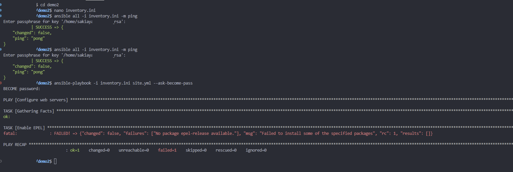

Then I wrote an actual first playbook, mostly copied from whatever tutorial I had open in another tab, and immediately hit a wall on a task called "Enable EPEL":

```
fatal: [demo-vm]: FAILED! => {"changed": false, "failures": ["No package epel-release available"], "msg": "Failed to install some of the specified packages", "rc": 1, "results": []}
```

Which, in hindsight, is an incredibly obvious mistake once you know what EPEL actually is. It's Red Hat's "Extra Packages for Enterprise Linux" repo, a CentOS/RHEL thing. My disposable VM was Ubuntu. I'd grabbed a task straight out of a tutorial written for a completely different distro family without checking whether it applied to mine, which is exactly the kind of "verify before configuring" mistake I'd already written about myself back in part 2 with the Palworld webhook thing, and here I was doing it again, immediately, on a toy project this time instead of the real one. At least the blast radius was zero.

Ripped the EPEL task out entirely, replaced it with a plain `apt` install of nginx, and reran it:

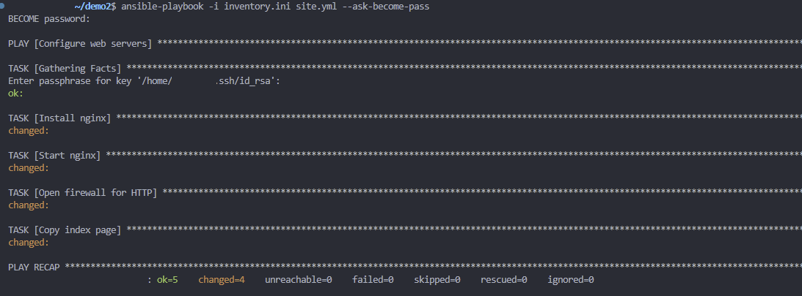

And then, because half the point of this exercise was proving the tool actually did what it claimed, I pointed a browser at the VM's IP:

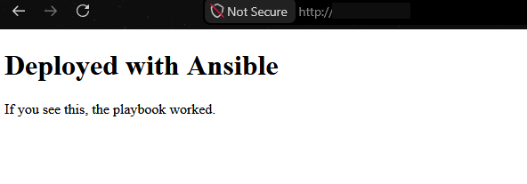

"If you see this, the playbook worked" is exactly the kind of deeply unglamorous milestone that feels disproportionately satisfying when you're learning a new tool. Then, since idempotency is the entire sales pitch of configuration management and I wanted to actually see it rather than take it on faith, I ran the exact same playbook again with nothing changed in between:

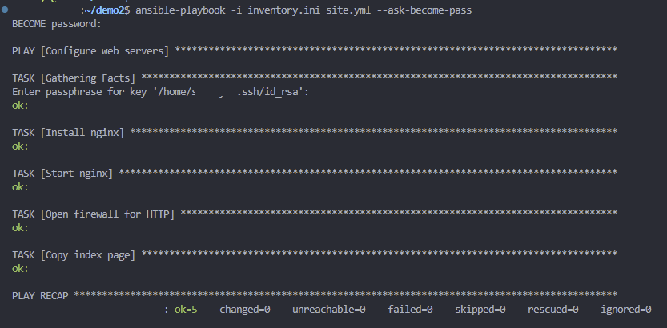

`changed=0` across the board. Nothing to do, because nothing had actually changed, which is the whole point, and also just satisfying to watch happen on purpose instead of by accident.

Next thing I wanted to actually understand hands-on was handlers, the notify/handler pattern where a task only triggers a follow-up action, like restarting a service, when it genuinely changes something, instead of restarting nginx on every single run regardless of whether anything's different:

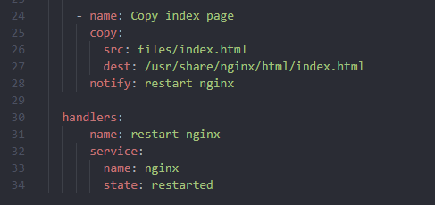

Edited the actual index page content, reran the playbook, and watched the handler fire because something had genuinely changed this time:

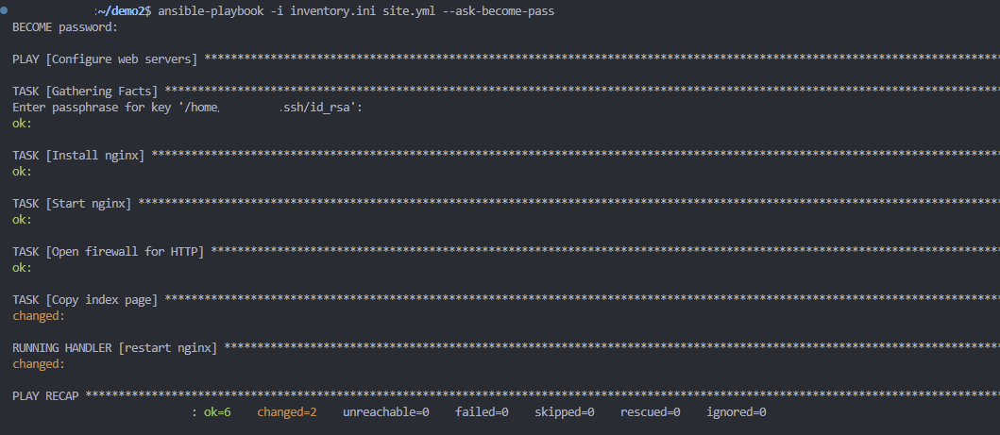

Copy task changed, handler ran, nginx restarted, exactly once, exactly because it needed to. Last thing I wanted to poke at before I felt like I'd earned the right to touch the real project: swapping the static `copy` module out for `ansible.builtin.template`, so the page content could actually use a Jinja variable instead of being a dumb, static file:

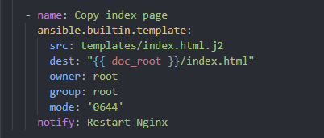

Reran it, handler fired again on the switch, same shape as before, just a more capable tool underneath it now:

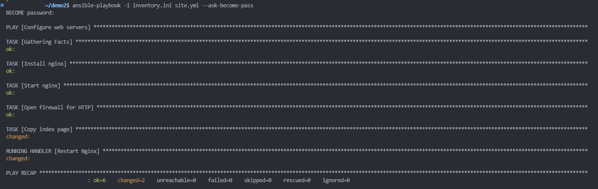

None of this was hard, and none of it was meant to be. That was the point. Get the dumb mistakes, the EPEL-on-Ubuntu kind of thing, out of the way against a box nobody's relying on, so that by the time I actually sat down to rewrite the real setup scripts, the tool itself wasn't also a variable I was debugging at the same time as everything else.

## Packaging it as something someone else could actually run

Everything up to here was written to keep one specific server running. The next ask was a genuinely different problem: let anyone else stand up the same stack, not just me. The live VM's setup scripts were written one at a time, each assuming whatever the last one left behind, with the same passwords typed directly into four of them independently. Fine for one operator who already knows which script to run next in what order. Not remotely something a stranger could clone and run cold.

Rather than rewrite the live infrastructure in place, real risk to a server 200 people actually play on, for zero operational benefit to anyone, the rebuild happened in a fresh sibling directory, leaving the live server and this entire project completely untouched as the ops reference it's always been.

Ansible replaces "SSH in and run a bash script, in order, from memory" with a playbook: an ordered list of roles, folders of small declarative tasks, "make sure this package is installed," not "run this imperative command and hope." The mapping onto the existing script chain was close to 1:1: system prep, user creation, LGSM install, firewall, and the `.ini` patching collapsed into one `palworld_server` role; the NAS mount and backup/offload scripts into `omv_backup`; the cron script into `cron_jobs`, now genuinely idempotent via Ansible's own cron module instead of the original script's manual dedup dance; the Docker Compose stack, bot, status page, and tunnel into a role I renamed `status_stack` partway through, since its old name, `discord_bot_stack`, stopped being accurate the moment nginx and cloudflared became clearly first-class parts of it rather than incidental to "the discord bot"; the restart watcher from earlier in this post into its own role, same `KillMode=process` fix, just templated instead of a fixed heredoc. One genuinely new role had no script equivalent at all: installing Docker itself, which the original setup never actually scripted, it just assumed present, which, in fairness, it always had been, right up until it wasn't.

The single biggest conceptual shift, and the thing my little nginx demo actually taught me to appreciate: the old scripts were run-once. Running the firewall or cron script a second time risked duplicate rules, the entire reason the cron script needed its own dedup logic back in part 1. Ansible tasks describe a desired end state instead, re-running the whole playbook after changing one value is always safe and just reconciles the drift, nothing more, nothing dramatic.

Every hardcoded password and `### EDIT THESE ###` block that used to live inside a script now lives in exactly one of two files, split by sensitivity: a plain vars file for ports, timezone, schedule, NAS IP, and the whole ruleset that used to be forty separate `patch` lines, safe to commit, and a secrets file, every password and token, encrypted at rest with `ansible-vault`. Jinja2 templates connect the two: the same file as before, but the literal password string becomes a template variable, filled in only at deploy time, written only onto the target VM. Rotating a password everywhere it's used is now one edit instead of a grep-and-fix pass across four separate files.

A separate question came up: should the public-facing nginx/cloudflared pair get split out from the bot container to shrink attack surface further? Turned out the isolation that mattered was already there, just not obvious at a glance. The bot runs on the host's own network, which means it was never on the same Docker network as nginx or the tunnel in the first place, and neither of those two containers mounts anything from the bot's side, no `.env`, no bind mount, no restart trigger files. Compromising nginx or cloudflared today gets an attacker read access to static HTML and a TLS key, and nothing else. A fully separate host for the public site got considered and set aside, real hardening in theory, but a second host to patch and a new push credential to manage, for marginal gain against something already outbound-only or static-file-only anyway.

With no Ansible install existing in this particular environment, and nothing going to run against the live server just to test it, validation happened without a real target: a disposable virtualenv, a syntax check against the full playbook with dummy inventory and vars, every Jinja2 template rendered standalone with strict-undefined mode, which fails loudly on any variable that isn't actually defined rather than silently rendering blank, the rendered Compose file and tunnel config re-parsed as YAML, the rendered shell scripts checked with `bash -n`, every copied Python file run through `ast.parse`. Same discipline as everywhere else in this build: a clean syntax check is not proof that the templates it doesn't actually render are correct, any more than a clean exit code proved the restarted server was still running a moment later, back earlier in this exact post.

## What the repo actually looked like before and after

Talking about "roles instead of scripts" in the abstract undersells how different the two repos actually look sitting side by side. Here's the old one, `palworld-live`, the thing that's actually been running the live server this whole series:

```
📦palworld-live
 ┣ 📂cloudflared
 ┃ ┗ 📜config.yml
 ┣ 📂discord-bot
 ┃ ┣ 📂status_page
 ┃ ┃ ┣ 📜script.js
 ┃ ┃ ┣ 📜style.css
 ┃ ┃ ┣ 📜template.html
 ┃ ┃ ┗ 📜__init__.py
 ┃ ┣ 📜.env.example
 ┃ ┣ 📜bot.py
 ┃ ┣ 📜charts.py
 ┃ ┣ 📜commands.py
 ┃ ┣ 📜config.py
 ┃ ┣ 📜discord_client.py
 ┃ ┣ 📜discord_ui.py
 ┃ ┣ 📜Dockerfile
 ┃ ┣ 📜favicon.png
 ┃ ┣ 📜palworld-bot.service
 ┃ ┣ 📜palworld_api.py
 ┃ ┣ 📜requirements.txt
 ┃ ┣ 📜status_loop.py
 ┃ ┣ 📜storage.py
 ┃ ┗ 📜utils.py
 ┣ 📂dockge-agent
 ┃ ┗ 📜docker-compose.yml
 ┣ 📂setup
 ┃ ┣ 📂proxmox
 ┃ ┃ ┗ 📜01-create-vm.sh
 ┃ ┣ 📜00-system-prep.sh
 ┃ ┣ 📜01-create-user.sh
 ┃ ┣ 📜02-install-lgsm.sh
 ┃ ┣ 📜03-firewall.sh
 ┃ ┣ 📜04-cron-setup.sh
 ┃ ┣ 📜05-palworldsettings.sh
 ┃ ┣ 📜06-omv-mount.sh
 ┃ ┣ 📜07-status-page.sh
 ┃ ┣ 📜08-cloudflare-tunnel.sh
 ┃ ┣ 📜09-bot-restart-watcher.sh
 ┃ ┣ 📜backup-with-warning.sh
 ┃ ┣ 📜network-layout.txt
 ┃ ┣ 📜offload-backup.sh
 ┃ ┣ 📜restart-with-warning.sh
 ┃ ┗ 📜vlan-segmentation.txt
 ┣ 📂status-page
 ┃ ┣ 📂origin-certs
 ┃ ┃ ┗ 📜README.txt
 ┃ ┗ 📜nginx.conf
 ┣ 📜ADMIN-GUIDE.md
 ┣ 📜BLOG-NOTES.md
 ┣ 📜DEPENDENCY-MAP.md
 ┗ 📜docker-compose.yml
```

A few things jump out once it's laid out like this instead of living entirely in my head. There are **two `docker-compose.yml` files**, one at the repo root and one inside `dockge-agent/`, and only one of them is actually the file Dockge deploys from. There are also **two things called "status page"**, `discord-bot/status_page/` (the Python module that renders the HTML) and the top-level `status-page/` (the nginx config that serves it), close enough in name that I still have to think for a second about which one I mean. Notes, docs, and the actual deploy scripts all sit at the same level, `ADMIN-GUIDE.md` next to `03-firewall.sh` next to `docker-compose.yml`, which is exactly the kind of layout that made the dependency map from part 3 worth building in the first place. Nothing here is *wrong*, it's just the natural shape a repo takes when it grows one script at a time over months instead of being planned as a whole.

Here's `palworld-ops-toolkit`, the rebuild, same project, completely different shape:

```
📦palworld-ops-toolkit
 ┣ 📂docs
 ┃ ┣ 📜ARCHITECTURE.md
 ┃ ┣ 📜OPERATIONS.md
 ┃ ┗ 📜SECURITY.md
 ┣ 📂inventory
 ┃ ┗ 📜hosts.yml.example
 ┣ 📂roles
 ┃ ┣ 📂cron_jobs
 ┃ ┃ ┗ 📂tasks
 ┃ ┃ ┃ ┗ 📜main.yml
 ┃ ┣ 📂docker_engine
 ┃ ┃ ┗ 📂tasks
 ┃ ┃ ┃ ┗ 📜main.yml
 ┃ ┣ 📂omv_backup
 ┃ ┃ ┣ 📂tasks
 ┃ ┃ ┃ ┗ 📜main.yml
 ┃ ┃ ┗ 📂templates
 ┃ ┃ ┃ ┣ 📜backup-with-warning.sh.j2
 ┃ ┃ ┃ ┣ 📜offload-backup.sh.j2
 ┃ ┃ ┃ ┣ 📜restart-with-warning.sh.j2
 ┃ ┃ ┃ ┗ 📜smb-credentials.j2
 ┃ ┣ 📂palworld_server
 ┃ ┃ ┣ 📂tasks
 ┃ ┃ ┃ ┣ 📜create_user.yml
 ┃ ┃ ┃ ┣ 📜firewall.yml
 ┃ ┃ ┃ ┣ 📜install_lgsm.yml
 ┃ ┃ ┃ ┣ 📜main.yml
 ┃ ┃ ┃ ┣ 📜palworld_settings.yml
 ┃ ┃ ┃ ┗ 📜system_prep.yml
 ┃ ┃ ┗ 📂templates
 ┃ ┃ ┃ ┣ 📜lgsm-common.cfg.j2
 ┃ ┃ ┃ ┗ 📜palworld_settings_patch.sh.j2
 ┃ ┣ 📂restart_watcher
 ┃ ┃ ┣ 📂handlers
 ┃ ┃ ┃ ┗ 📜main.yml
 ┃ ┃ ┣ 📂tasks
 ┃ ┃ ┃ ┗ 📜main.yml
 ┃ ┃ ┗ 📂templates
 ┃ ┃ ┃ ┣ 📜bot-restart-handler.sh.j2
 ┃ ┃ ┃ ┣ 📜bot-restart-watcher.path.j2
 ┃ ┃ ┃ ┗ 📜bot-restart-watcher.service.j2
 ┃ ┗ 📂status_stack
 ┃ ┃ ┣ 📂files
 ┃ ┃ ┃ ┗ 📂app
 ┃ ┃ ┃ ┃ ┣ 📂status_page
 ┃ ┃ ┃ ┃ ┃ ┣ 📜script.js
 ┃ ┃ ┃ ┃ ┃ ┣ 📜style.css
 ┃ ┃ ┃ ┃ ┃ ┣ 📜template.html
 ┃ ┃ ┃ ┃ ┃ ┗ 📜__init__.py
 ┃ ┃ ┃ ┃ ┣ 📜bot.py
 ┃ ┃ ┃ ┃ ┣ 📜charts.py
 ┃ ┃ ┃ ┃ ┣ 📜commands.py
 ┃ ┃ ┃ ┃ ┣ 📜config.py
 ┃ ┃ ┃ ┃ ┣ 📜discord_client.py
 ┃ ┃ ┃ ┃ ┣ 📜discord_ui.py
 ┃ ┃ ┃ ┃ ┣ 📜Dockerfile
 ┃ ┃ ┃ ┃ ┣ 📜favicon.png
 ┃ ┃ ┃ ┃ ┣ 📜palworld_api.py
 ┃ ┃ ┃ ┃ ┣ 📜requirements.txt
 ┃ ┃ ┃ ┃ ┣ 📜status_loop.py
 ┃ ┃ ┃ ┃ ┣ 📜storage.py
 ┃ ┃ ┃ ┃ ┗ 📜utils.py
 ┃ ┃ ┣ 📂tasks
 ┃ ┃ ┃ ┗ 📜main.yml
 ┃ ┃ ┗ 📂templates
 ┃ ┃ ┃ ┣ 📜cloudflared-config.yml.j2
 ┃ ┃ ┃ ┣ 📜docker-compose.yml.j2
 ┃ ┃ ┃ ┣ 📜env.j2
 ┃ ┃ ┃ ┗ 📜nginx.conf.j2
 ┣ 📂vars
 ┃ ┣ 📜main.yml
 ┃ ┗ 📜secrets.yml.example
 ┣ 📜.gitignore
 ┣ 📜ansible.cfg
 ┣ 📜LICENSE
 ┣ 📜Makefile
 ┣ 📜README.md
 ┣ 📜requirements.yml
 ┗ 📜site.yml
```

Same bot, same nginx, same cloudflared, same firewall rules, same cron schedule, none of the actual functionality changed. But every one of the nine old numbered scripts and the two competing compose files now maps onto exactly one of six `roles/`, each with its own `tasks/` doing the work and its own `templates/` for anything that used to be a hardcoded value. `vars/main.yml` and `vars/secrets.yml.example` replace every `### EDIT THESE ###` block that used to live inside a script, split cleanly by whether the value is safe to commit or needs to go through `ansible-vault`. `docs/` replaces `ADMIN-GUIDE.md` and `DEPENDENCY-MAP.md` sitting loose at the repo root, split into `ARCHITECTURE.md`, `OPERATIONS.md`, and `SECURITY.md` so a new operator can find the one they actually need instead of skimming one giant file. `inventory/hosts.yml.example` and `vars/secrets.yml.example` mean nothing real, no hostnames, no passwords, ever has to touch the repo itself, just the `.example` files a new deploy copies and fills in locally. And the whole thing now has a single entry point, `site.yml`, plus a `Makefile` wrapping the two flags I kept forgetting, instead of nine scripts I had to remember the order of by hand.

The honest way to put it: the old repo is organized by *when I wrote each piece*. The new one is organized by *what each piece is responsible for*. The first is a completely normal shape for infrastructure that grew live, one script at a time, against a server that couldn't go down. The second is the shape it has to take the moment the goal changes from "I can operate this" to "a stranger can operate this."

## The first real deploy, and everything only a real deploy could catch

The Ansible rewrite had been validated, not run: a syntax check, every template rendered against dummy values, the results re-parsed as YAML and checked with `bash -n` and `ast.parse`. All of that catches malformed input. None of it can catch a value that's well-formed but wrong, or a dependency the scripts had just been quietly assuming was already there. Before pointing any of it at a real host, one more pass scrubbed the last traces of the original identity: the project's own working name renamed to `palworld-ops-toolkit`, directory included, the hardcoded server name pulled out of the bot's embed title and the status page's `<title>`/`<h1>` and replaced with a `SERVER_NAME` variable sourced from the same vars file everything else reads from, and a real SSH username and a code comment naming a personal domain, both removed, since neither belonged in something meant to be shared under a different identity.

Then the first real run against a disposable VM surfaced six bugs in a single pass, which is exactly the gap a disposable-VM test exists to close in the first place:

- **The environment itself fought back before the playbook even got a chance to.** Working from a Windows drive mounted into WSL, every file reports as world-writable regardless of its real ACLs, and Ansible silently refuses to trust a config file sitting in a world-writable directory. No error, it just quietly ignores it. The inventory path in `ansible.cfg` never actually took effect until I passed it explicitly on the command line. Baked that into the `Makefile`'s targets so a future me, or anyone else, never has to discover it the hard way, and added a passthrough variable for extra flags at the same time, since my first attempt to pass one, `make deploy -i inventory/hosts.yml`, went straight to `make` itself instead of Ansible: `make` doesn't forward arbitrary flags into a recipe, it read `-i` as its own "ignore errors" switch and the inventory path as a build target it then couldn't find anything to do for.

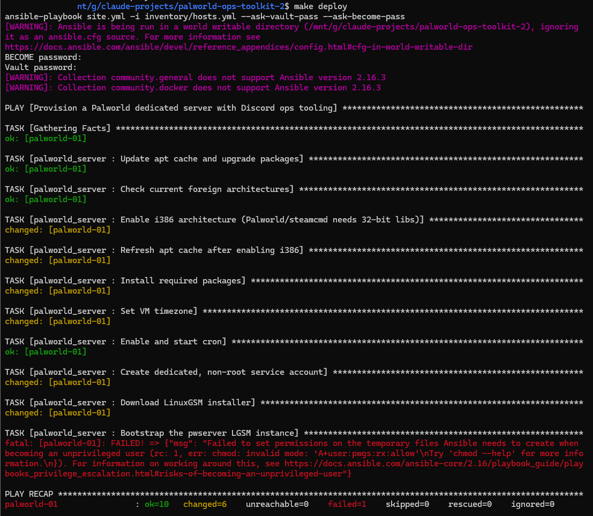

- **Two separate passwords needed two separate flags.** SSH key auth worked fine for login, but the playbook still failed with `"Missing sudo password"`, since privilege escalation on the target is a second, completely independent auth step from the SSH login itself, and the flag for it was just missing from my command. Added it permanently to both `Makefile` targets, so a deploy now prompts for exactly the two secrets it actually needs and nothing gets silently skipped.
- **A missing package broke user de-escalation in a way that looked, at first, like a syntax error.** Tasks that drop from root to the unprivileged game-server user failed with `chmod: invalid mode: 'A+user:pwgs:rx:allow'`, an NFSv4 ACL syntax that doesn't even exist on Linux. Ansible only falls back to that when it can't find `setfacl`/`getfacl` on the target, and a minimal Ubuntu image doesn't ship the `acl` package by default. Added it to system prep, ahead of the first privilege-handoff task, so the next fresh box never hits this at all.
- **A one-character Jinja precedence bug silently broke every Docker install.** The architecture line for Docker's apt repo read `ansible_architecture == 'x86_64' | ternary('amd64', 'arm64')`. Jinja's `|` binds tighter than `==`, so the ternary actually ran against the literal string `'x86_64'`, always truthy, always returning `'amd64'`, and the outer comparison against the real architecture value then came back false on every genuine x86_64 host. The rendered repo line ended up with `arch=False`, an architecture apt has never once heard of, so it silently matched zero packages. Fixed by parenthesizing the comparison explicitly. Completely invisible in a syntax check or a dummy-value template render, it only shows up once real apt metadata gets queried against the wrong string.
- **LGSM's own dependency list was longer than what actually got installed.** `pwserver details` reported six more packages LGSM expects for Palworld specifically, added all six to system prep. One of them, `steamcmd`, carries an interactive Steam EULA prompt on install that would've hung the whole run waiting on a terminal that doesn't exist under Ansible, pre-seeded the answer ahead of the install task so it runs unattended the way a role is supposed to.
- **The bug that actually mattered: the game port never changed.** The firewall opened the configured port correctly. The game's own `.ini` got patched with it correctly. And the server kept listening on the old default port anyway, like none of that mattered at all. LGSM keeps a completely separate launch-parameter file controlling the actual command-line flags the server process is launched with, the `.ini`'s port field is metadata the server *reports*, not what socket it actually *binds* to, and nothing in the original role had ever touched that file. Added a template writing the real launch parameters from the same variables everything else already reads, so the correct port is live from the very first launch instead of needing a manual restart after the fact. The same shape of bug as the stale firewall port flagged back in the dependency-map work in part 3, a value living in two places that can silently drift apart, just one layer further down this time, and I still fell for the same shape of trap.

The second, successful run, after the acl fix, actually made it through the whole thing end to end:

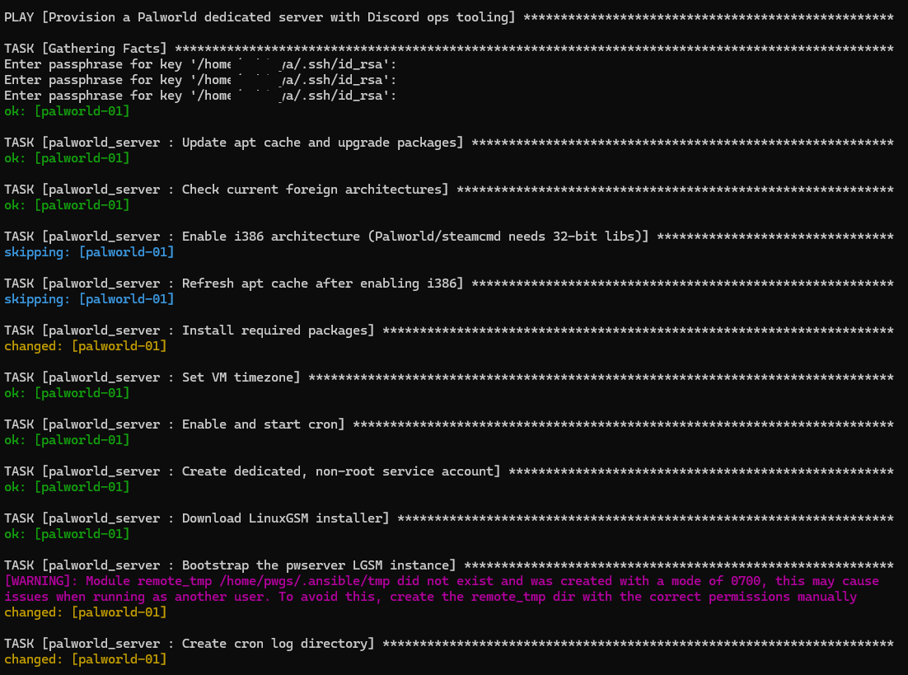

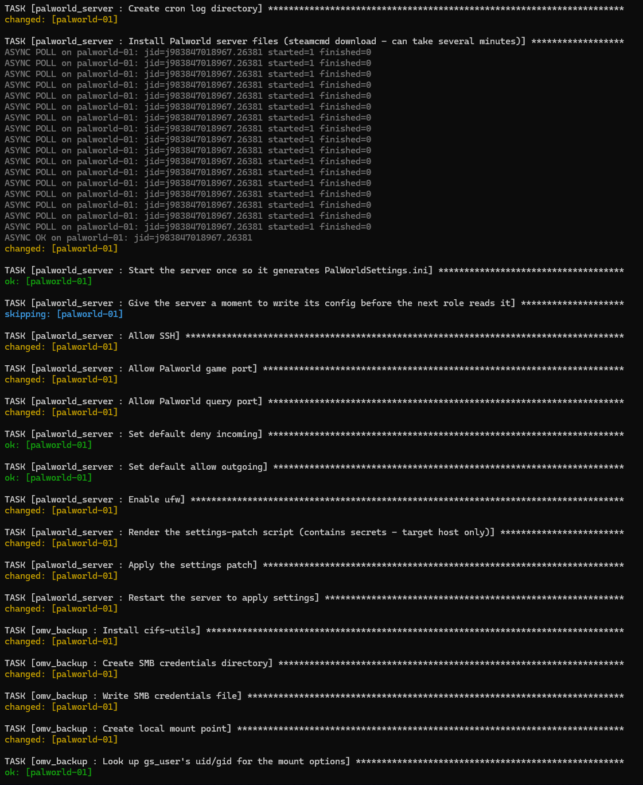

Every role also got its own tag, so a partial deploy, standing up just the bot and status page without also needing a real NAS share to test against, became possible without failing on the one piece that isn't available yet. And a clean run got treated as necessary, not sufficient: verified the process was actually bound to the configured port, the REST API reachable, all three containers up and not restart-looping, `/restart-vote` actually restarting the real server end to end, the public page reachable through the tunnel showing the right name, cron entries present. Then, separately, ran the whole deploy a second time with nothing changed and confirmed it reported almost nothing as changed. Idempotency isn't something a first successful run proves. Only a second, identical one actually does, same lesson my little nginx demo already tried to teach me a few days earlier.

## Where it landed

The live server is exactly where it was at the end of part 3, up, backed up, alertable, restartable by vote, fronted by a status page that can't become a liability, plus a restart button that now actually works end to end, and an async event loop that no longer freezes for five minutes at a time every time someone starts a vote. Sitting next to it, now proven against a real disposable VM rather than just a syntax check, is a second version of the whole thing anyone else could actually deploy: one command to bring up a fresh box, one encrypted file holding every secret, and none of the one-operator assumptions baked into the original scripts.

The same instinct closed out every part of this post, and honestly the whole series. Three of the four restart bugs produced no error at all, or a convincingly wrong one. Both async bugs hid behind Discord's own optimistic UI rather than throwing anything. Every one of the six deploy bugs was invisible to static validation by definition, each one needed a real host to actually surface against, the exact reason I bothered practicing on a throwaway VM before any of it touched the real thing. The fix, every single time, was the same one this whole series keeps coming back to: don't trust a clean exit code, an empty error log, a `returncode: 0`, or a clean `PLAY RECAP` as proof of anything on its own. Go look at the actual state, one layer down, every time, no exceptions.
